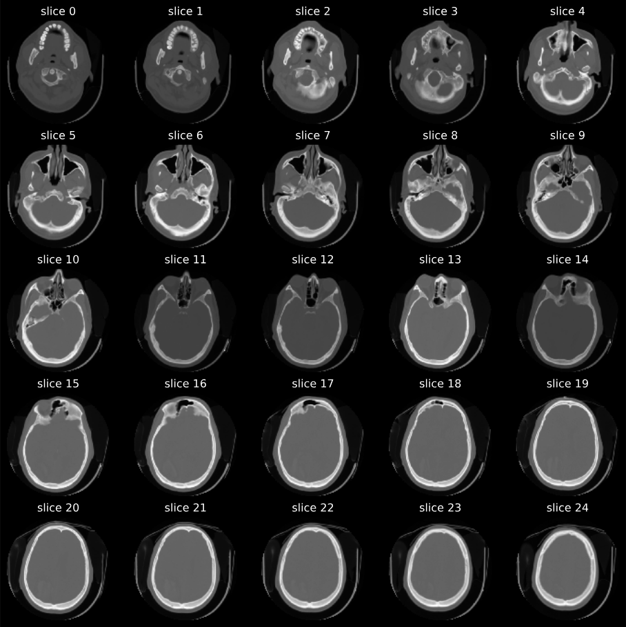

# Computer Vision - Brain CT Scans  
Repo for a Computer Vision project to detect abnormatlities in brain CT scans.  
Link to website and original study: [Qure.ai](http://headctstudy.qure.ai/#dataset)

## Download the Dataset  
Total size of all downloaded zip folders is roughly 40-50GB  
The urls for the downloads are found in `docs/cq500_files.txt`  

Run one of these commands from bash or zsh.  If you are using OSX you can use install wget with  
```bash
brew install wget
```
Then run:
```bash
wget -i docs/cq500_files.txt
```  

## DICOM  
[DICOM](https://en.wikipedia.org/wiki/DICOM) images require different pre-processing than normal jpg or png files. The `pydicom` library is useful for this task. Below is a sample of one set of scans. After reading in the scans, they must be converted to a 3D numpy array.  

